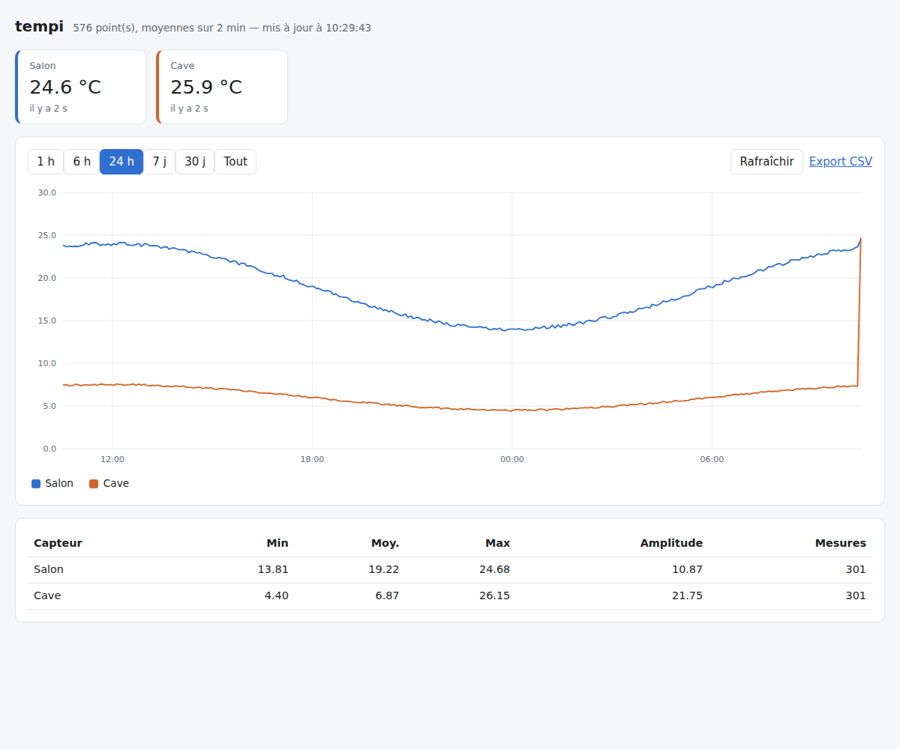
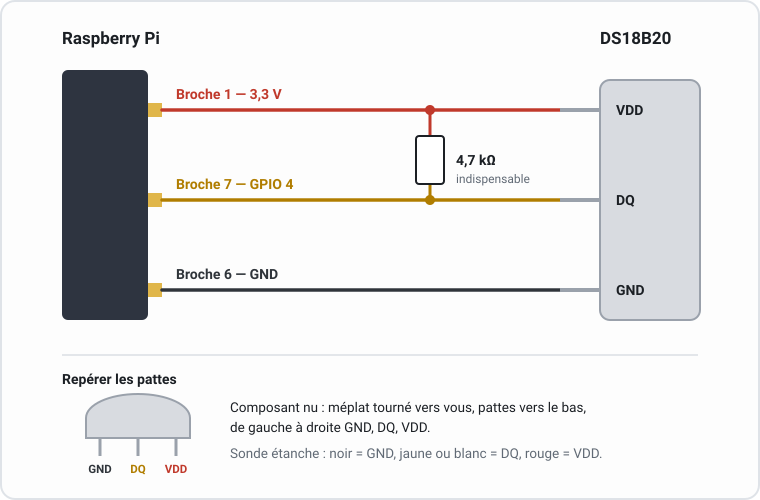
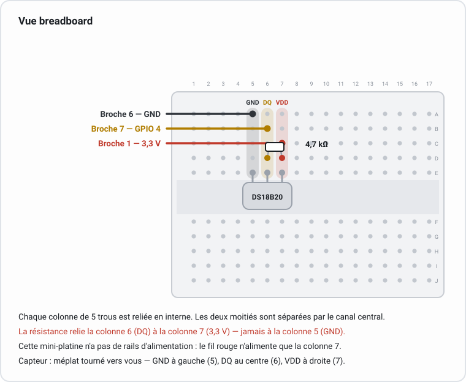

# tempi

Enregistrement et visualisation de l'évolution de la température mesurée par un
ou plusieurs capteurs **DS18B20** sur un **Raspberry Pi**.

- collecte périodique, tolérante aux erreurs de lecture du bus 1-Wire ;
- stockage dans une base **SQLite** unique, sans serveur à administrer ;
- interface web avec graphique, plages de 1 heure à « tout l'historique »,
  statistiques et export CSV ;
- **température extérieure** relevée sur une API publique et traitée comme un
  capteur supplémentaire, pour comparer l'intérieur au dehors ;
- **binaire autonome** : un seul fichier à déposer sur le Pi, sans runtime ni
  paquet à installer, et rien à compiler sur place ;
- service `systemd` prêt à l'emploi.



---

## 1. Câblage

Le DS18B20 se branche sur le bus 1-Wire, par défaut sur le **GPIO 4**
(broche physique 7).



Le même montage sur une mini-platine d'essai, trou par trou :



**Une résistance de tirage de 4,7 kΩ entre DQ et 3,3 V est indispensable** :
sans elle, le bus reste muet ou renvoie des valeurs erratiques. Elle est déjà
intégrée aux modules DS18B20 vendus sur petite carte, mais pas aux composants
nus ni aux sondes étanches.

Plusieurs capteurs se branchent **en parallèle sur les mêmes trois fils**, avec
une seule résistance de tirage pour l'ensemble : chaque DS18B20 possède une
adresse unique gravée en usine, et tempi les découvre automatiquement.

> Le montage « en parasite » (VDD relié à GND) fonctionne mal au-delà de
> quelques dizaines de centimètres. Alimentez le capteur en 3,3 V.

### Précision affichée

Le DS18B20 est donné à **±0,5 °C** entre −10 et +85 °C, pour une résolution de
0,0625 °C. La résolution ne compensant pas l'incertitude, tempi affiche le
dixième de degré : le centième ferait passer du bruit pour une mesure.

Les valeurs restent enregistrées et exposées sans arrondi dans la base, dans
l'API et dans l'export CSV — seul l'affichage est arrondi.

## 2. Activation du bus 1-Wire

```bash
sudo raspi-config     # Interface Options > 1-Wire > Yes
sudo reboot
```

Équivalent manuel — ajouter à `/boot/firmware/config.txt` (Raspberry Pi OS
Bookworm ou plus récent) ou `/boot/config.txt` (versions antérieures) :

```
dtoverlay=w1-gpio
```

Après redémarrage, chaque capteur apparaît comme un répertoire dont le nom
commence par `28-` :

```bash
$ ls /sys/bus/w1/devices/
28-000005e2fdc3  w1_bus_master1
```

Si rien n'apparaît, reprenez le câblage et la résistance de tirage avant toute
autre piste : c'est la cause de loin la plus fréquente.

## 3. Installation

Un Raspberry Pi **64 bits** est nécessaire : `uname -m` doit répondre `aarch64`.
Cela exclut les Pi 1, Zero et Zero W, dont le processeur ARMv6 n'est pas pris en
charge par .NET, ainsi qu'un système 32 bits installé sur un Pi qui, lui, le
serait — le script le signale avant de télécharger quoi que ce soit.

```bash
git clone https://github.com/Orkad/tempi.git ~/tempi
```

### Installer

```bash
cd ~/tempi
sudo ./scripts/install.sh
```

Le script active le 1-Wire si besoin, crée l'utilisateur système `tempi`,
télécharge la dernière version publiée, vérifie son empreinte SHA-256, installe
le binaire dans `/opt/tempi/bin/`, dépose la configuration dans
`/etc/tempi/tempi.env` et démarre le service. Il est idempotent : le relancer
met à jour l'installation sans écraser votre configuration ni votre base de
mesures.

Le dépôt n'est cloné que pour les scripts et l'unité systemd. L'application
elle-même vient de la release : elle n'est pas compilée sur le Pi.

Deux variantes, quand la dernière version ne convient pas :

```bash
sudo ./scripts/install.sh v1.2.0           # une version précise
sudo ./scripts/install.sh ./tempi.tar.gz   # artefact local, sans réseau
```

L'interface est alors disponible sur <http://127.0.0.1:8080/>. Pour la rendre
accessible depuis le réseau local, voir la section [Accès réseau](#7-accès-réseau).

### Mettre à jour

```bash
~/tempi/scripts/update.sh
```

Compare la dernière version publiée à celle installée et s'arrête sans toucher
au service si elle est déjà à jour ; sinon elle est téléchargée et le service
redémarre. À lancer **sans** `sudo` : le script l'appelle lui-même pour la seule
partie qui en a besoin. Comme `install.sh`, il accepte une version précise ou un
artefact local, et `--force` réinstalle même à version égale.

Un `git pull` dans `~/tempi` reste utile de temps à autre : c'est de là que
viennent les scripts et l'unité systemd, que la release ne contient pas.

### Sans installation

Le dépôt se lance tel quel depuis un poste de développement, avec le SDK .NET 10 :

```bash
dotnet run --project src/Tempi -- --simulate run
```

L'option `--simulate` remplace le matériel par un capteur virtuel : pratique
pour découvrir l'interface sans Raspberry Pi.

## 4. Utilisation

```bash
tempi doctor                     # diagnostique le bus et nomme la panne
tempi sensors                    # capteurs détectés et capteurs connus de la base
tempi read                       # lecture immédiate, sans rien enregistrer
tempi collect                    # boucle de collecte seule
tempi serve                      # interface web seule
tempi run                        # collecte + interface dans un seul processus
tempi outdoor                    # vérifie la source de température extérieure
tempi label 28-000005e2fdc3 Salon
tempi stats
tempi export --range 30d -o mesures.csv
tempi prune --retention-days 365 --vacuum
```

Exemple :

```
$ tempi sensors
2 capteur(s) détecté(s) sur le bus :
  28-000005e2fdc3    21.4 °C
  28-000005e30a1b     4.8 °C

Capteurs enregistrés dans /var/lib/tempi/tempi.db :
  28-000005e2fdc3 « Salon »  43 210 mesure(s), dernière vue 2026-08-15 10:28:00
  28-000005e30a1b « Cave »   43 210 mesure(s), dernière vue 2026-08-15 10:28:00
```

Un capteur peut aussi être renommé depuis l'interface web, en cliquant sur son
nom dans la carte correspondante.

## 5. Configuration

Toute la configuration passe par des variables d'environnement, surchargeables
par les options de la ligne de commande. Pour le service, éditez
`/etc/tempi/tempi.env` puis `sudo systemctl restart tempi`.

| Variable | Défaut | Rôle |
|---|---|---|
| `TEMPI_DB` | `/var/lib/tempi/tempi.db` | fichier SQLite |
| `TEMPI_INTERVAL` | `60` | secondes entre deux relevés (minimum 1) |
| `TEMPI_MIN_DELTA` | `0` | bande morte en °C (voir ci-dessous) |
| `TEMPI_MAX_INTERVAL` | `900` | durée maximale sans enregistrement malgré la bande morte |
| `TEMPI_RETENTION_DAYS` | `0` | purge automatique, `0` = illimité |
| `TEMPI_HOST` | `127.0.0.1` | adresse d'écoute de l'interface web |
| `TEMPI_PORT` | `8080` | port d'écoute |
| `TEMPI_W1_DIR` | `/sys/bus/w1/devices` | répertoire des périphériques 1-Wire |
| `TEMPI_READ_RETRIES` | `3` | tentatives par relevé avant abandon |
| `TEMPI_ALLOW_RESET_VALUE` | `0` | accepter la valeur suspecte de 85 °C |
| `TEMPI_SIMULATE` | `0` | capteur virtuel, sans matériel |
| `TEMPI_OUTDOOR_PROVIDER` | — | source extérieure : `metar`, `infoclimat`, `open-meteo` |
| `TEMPI_OUTDOOR_STATION` | — | code OACI (`metar`) ou identifiant StatIC (`infoclimat`) |
| `TEMPI_OUTDOOR_LAT` / `TEMPI_OUTDOOR_LON` | — | coordonnées, pour `open-meteo` |
| `TEMPI_OUTDOOR_TOKEN` | — | clé d'API, pour `infoclimat` |
| `TEMPI_OUTDOOR_LABEL` | `Extérieur` | nom affiché du pseudo-capteur |
| `TEMPI_OUTDOOR_INTERVAL` | `600` | secondes entre deux interrogations (minimum 60) |
| `TEMPI_OUTDOOR_TIMEOUT` | `10` | délai d'attente réseau, en secondes |

### Bande morte et usure de la carte SD

Une mesure occupe environ 20 octets, soit **10 Mio par an et par capteur** avec
un relevé chaque minute. C'est peu, mais chaque écriture use la carte SD.

`TEMPI_MIN_DELTA` n'enregistre une mesure que si elle s'écarte suffisamment de
la précédente. Avec `TEMPI_MIN_DELTA=0.2` et `TEMPI_MAX_INTERVAL=900`, une pièce
dont la température est stable ne génère qu'un point tous les quarts d'heure,
tout en conservant la pleine résolution lors des variations rapides. Le point
périodique forcé évite les trous de courbe et prouve que le capteur répond
toujours.

`TEMPI_RETENTION_DAYS` supprime en plus les mesures anciennes, une fois par jour.

### Température extérieure

Une courbe intérieure ne se lit bien qu'en regard de la température extérieure.
tempi peut la relever sur une API publique et l'enregistrer **comme un capteur
de plus** : elle apparaît dans le graphique, les statistiques, l'export CSV et
l'API HTTP sans rien de particulier à faire. Son adresse a la forme
`outdoor-<fournisseur>-<station>` et son nom par défaut est « Extérieur » ;
comme tout capteur, il se renomme depuis l'interface web.

```bash
# Observation d'une station réelle, sans clé d'API
TEMPI_OUTDOOR_PROVIDER=metar TEMPI_OUTDOOR_STATION=LFLY tempi outdoor
```

```
$ tempi outdoor
Source   : METAR LFLY
Capteur  : outdoor-metar-LFLY « Extérieur »
Mesure   : 21.7 °C
Observée : 2026-08-16 19:05:32 (il y a 10 min)
```

La commande `tempi outdoor` ne fait que vérifier la source, comme `tempi read`
pour le bus 1-Wire ; `--store` enregistre le relevé. Une fois la configuration
en place, `tempi collect` et `tempi run` interrogent la source d'eux-mêmes.

| Fournisseur | Clé | Nature de la donnée |
|---|---|---|
| `metar` | aucune | **mesure réelle** sous abri normalisé, sur un aérodrome (souvent excentré) |
| `infoclimat` | gratuite | **mesure réelle** du réseau StatIC, bien plus dense en ville |
| `open-meteo` | aucune | **sortie de modèle** interpolée sur une grille de quelques kilomètres |

Aucune API ne donne la température mesurée *à une adresse* : une mesure vient
d'une station physique. Le choix se ramène donc à un arbitrage entre proximité
et fiabilité. À Lyon, `LFLY` (Bron) est à environ 8 km de la Presqu'île, où
l'îlot de chaleur urbain crée couramment 2 à 4 °C d'écart la nuit ; une station
StatIC intra-muros sera nettement plus représentative.

**`metar`** — code OACI à quatre lettres, via aviationweather.gov (NOAA) :

```
TEMPI_OUTDOOR_PROVIDER=metar
TEMPI_OUTDOOR_STATION=LFLY
```

**`infoclimat`** — réseau StatIC, identifiant de station et clé obtenue sur
[infoclimat.fr/opendata](https://www.infoclimat.fr/opendata/) après création
d'un compte et déclaration d'un usage commercial ou non :

```
TEMPI_OUTDOOR_PROVIDER=infoclimat
TEMPI_OUTDOOR_STATION=000JT
TEMPI_OUTDOOR_TOKEN=…
```

> La clé Infoclimat est liée à **l'adresse IP appelante**. Derrière une IP
> résidentielle dynamique, elle cesse de fonctionner à chaque changement d'IP ;
> tempi le signale alors dans le journal et continue d'enregistrer les DS18B20.
> Les données sont sous Licence Ouverte ou Creative Commons selon la station :
> citez « Infoclimat (StatIC) » si vous les rediffusez.

**`open-meteo`** — coordonnées décimales, sans inscription :

```
TEMPI_OUTDOOR_PROVIDER=open-meteo
TEMPI_OUTDOOR_LAT=45.7578
TEMPI_OUTDOOR_LON=4.8320
```

Trois précautions valent pour les trois fournisseurs :

- l'horodatage enregistré est celui **de l'observation**, pas celui de la
  requête, sinon la courbe extérieure serait décalée du délai de diffusion ;
- une observation déjà connue n'est pas réenregistrée — les stations ne
  publient que toutes les 6 à 60 minutes, d'où un `TEMPI_OUTDOOR_INTERVAL` par
  défaut de 10 minutes et un plancher à 60 secondes ;
- l'interrogation tourne dans son propre thread. Une API lente ou indisponible
  décale la courbe extérieure, jamais les relevés du DS18B20.

## 6. API HTTP

| Méthode et route | Description |
|---|---|
| `GET /` | interface web |
| `GET /api/health` | état du service, de la base, du collecteur et de la source extérieure |
| `GET /api/sensors` | capteurs connus |
| `GET /api/latest` | dernière mesure de chaque capteur |
| `GET /api/series` | points d'une plage, éventuellement agrégés |
| `GET /api/summary` | minimum, moyenne, maximum sur une plage |
| `GET /api/export.csv` | export CSV |
| `POST /api/sensors/<adresse>/label` | renomme un capteur — corps `{"label": "Salon"}` |

Paramètres communs aux routes de consultation :

- `range` — fenêtre relative à maintenant : `30m`, `6h`, `7d`, `2w`, ou `all` ;
- `from` / `to` — bornes explicites, en epoch ou en ISO 8601 ;
- `sensor` — limite à une adresse, répétable ;
- `bucket` — agrégation : `raw` pour les points bruts, une durée (`10m`) ou un
  nombre de secondes. Par défaut, tempi choisit l'agrégation qui ramène la
  réponse à environ 800 points, quelle que soit la longueur de la plage.

Chaque point agrégé porte la moyenne (`celsius`) mais aussi le minimum et le
maximum de sa tranche, si bien que les extrêmes restent visibles même sur un
graphique couvrant plusieurs mois.

```bash
curl 'http://127.0.0.1:8080/api/series?range=24h&bucket=15m' | python3 -m json.tool
curl 'http://127.0.0.1:8080/api/export.csv?range=7d' -o semaine.csv
```

## 7. Accès réseau

Par défaut, l'interface n'écoute que sur `127.0.0.1` : elle n'est joignable que
depuis le Raspberry Pi lui-même. Pour l'ouvrir au réseau local, mettez
`TEMPI_HOST=0.0.0.0` dans `/etc/tempi/tempi.env` puis redémarrez le service.

**tempi n'a aucune authentification.** N'exposez l'interface que sur un réseau
de confiance. Pour un accès depuis l'extérieur, placez-la derrière un reverse
proxy assurant TLS et authentification, ou passez par un VPN.

## 8. Exploitation

```bash
sudo systemctl status tempi
sudo journalctl -u tempi -f
curl -s http://127.0.0.1:8080/api/health | python3 -m json.tool
```

Sauvegarde à chaud, sans arrêter le service :

```bash
sudo sqlite3 /var/lib/tempi/tempi.db ".backup '/tmp/tempi-$(date +%F).db'"
```

Le fichier SQLite est autonome : le copier suffit à déplacer tout l'historique
sur une autre machine.

### Séparer la collecte de l'interface web

Le service livré exécute `tempi run`, qui réunit les deux dans un seul
processus. Pour les séparer — par exemple pour n'exposer l'interface qu'à la
demande — dupliquez l'unité en remplaçant `ExecStart` par `tempi collect` d'un
côté et `tempi serve` de l'autre. Le mode WAL de SQLite autorise sans
difficulté un rédacteur et plusieurs lecteurs simultanés.

## 9. Dépannage

Commencez toujours par :

```bash
sudo tempi doctor
```

La commande vérifie l'overlay, les modules noyau, l'état du bus, le niveau
électrique de la ligne de données, la lecture de chaque capteur, le stockage et
le service. Elle nomme la panne et donne le geste correctif, et sort avec un code
non nul en cas d'échec — utilisable dans un script. `--json` produit une sortie
exploitable.

Le `sudo` n'est pas obligatoire, mais il permet un second balayage du bus, seul
moyen de distinguer une ligne à la masse d'une ligne flottante.

### Lire les périphériques fantômes

Un bus en défaut enregistre malgré tout des périphériques, de famille `00`.
**Ce ne sont pas des capteurs** : leur forme désigne la panne.

| Contenu de `/sys/bus/w1/devices/` | Cause |
|---|---|
| `w1_bus_master1` seul | le bus fonctionne mais ne voit rien : la donnée n'atteint pas le capteur, ou il n'est pas alimenté |
| Rien du tout | 1-Wire non activé, ou modules non chargés — un redémarrage est nécessaire après l'activation |
| `00-800000000000`, constant | ligne de données **tenue à la masse** : donnée et masse dans la même rangée, résistance branchée sur GND au lieu du 3,3 V, ou capteur à l'envers |
| ROM en `00-…` qui **changent** à chaque balayage | ligne de données **flottante** : la résistance de 4,7 kΩ ne relie pas la donnée au 3,3 V |
| Un `28-…` **et** des `00-…` | le capteur répond mais le bus est bruité : raccourcissez le câble, ou descendez la résistance à 2,2 kΩ |

### Autres symptômes

| Symptôme | Cause la plus probable |
|---|---|
| `valeur de reset 85 °C` dans le journal | alimentation insuffisante ou câble trop long ; alimentez en 3,3 V plutôt qu'en parasite |
| `CRC invalide` occasionnel | normal sur un câble long ; tempi réessaie, seuls les échecs répétés sont journalisés |
| Lectures qui s'arrêtent après quelques heures | fils trop longs ou trop nombreux : réduisez la résistance de tirage à 2,2 kΩ |
| `tempi: command not found` | installation antérieure à l'ajout du lien `/usr/local/bin/tempi` : relancez `scripts/install.sh` |
| Interface inaccessible depuis un autre poste | `TEMPI_HOST` vaut `127.0.0.1` (voir section 7) |
| Courbe interrompue | collecte arrêtée sur cette période ; tempi ne relie pas artificiellement les deux bords |

## 10. Développement

L'application est écrite en **C# / .NET 10**. Le SDK suffit, il n'y a aucun
outillage supplémentaire à installer :

```bash
dotnet test --solution src/Tempi.slnx              # toute la suite
dotnet run --project src/Tempi -- --simulate run   # interface, capteur virtuel
```

Le mode `--simulate` génère une température suivant un cycle journalier bruité,
ce qui permet de travailler sur l'interface sans matériel.

Organisation du code :

| Répertoire | Rôle |
|---|---|
| `src/Tempi/Sensors/` | lecture du bus 1-Wire, validation des trames, capteur simulé |
| `src/Tempi/Storage/` | schéma SQLite, écriture, requêtes, agrégation, purge |
| `src/Tempi/Collect/` | boucle de collecte, bande morte, rétention |
| `src/Tempi/Outdoor/` | température extérieure d'une API publique, exposée comme un capteur |
| `src/Tempi/Web/` | serveur Kestrel, API JSON, export CSV |
| `src/Tempi/Diagnostics/` | analyse de l'état du bus, sans accès système — donc testable partout |
| `src/Tempi/Cli/` | ligne de commande, sondes système du `doctor` |
| `src/Tempi/Hosting/` | hôtes de `run`, `serve` et `collect`, intégration systemd |
| `src/Tempi/Configuration/` | variables d'environnement, validation, chemins par défaut |
| `src/Tempi/wwwroot/index.html` | interface web (HTML, CSS et JavaScript sans dépendance), embarquée dans le binaire |

### Publication

L'artefact livré est autonome et trimmé — il n'embarque que le code atteint :

```bash
dotnet publish src/Tempi -c Release -r linux-arm64 --self-contained
```

Un tag `v*` produit cette archive et son empreinte et les attache à une release
GitHub, via `publish-release.yml`. Le trimming ne casse rien à la compilation : la
régression n'apparaît qu'à l'exécution, et sans avertissement. C'est pourquoi
l'intégration continue **démarre** le binaire trimmé et l'interroge, au lieu de se
contenter de le construire.

### Version

Numérotée selon [SemVer](https://semver.org) (`MAJOR.MINOR.PATCH`), exposée par
`tempi --version` et `/api/health`. Une seule source y fait autorité,
`src/Tempi/TempiVersion.cs` — voir sa remarque XML doc pour la règle complète.

La livraison est continue : `continuous-release.yml` publie une release à chaque
push sur `main`, sans étape manuelle.

- Rien à faire pour un correctif : si `TempiVersion.Value` n'a pas changé depuis
  la dernière release, le workflow incrémente le PATCH tout seul, committe,
  tague et publie.
- Pour un bump MINOR (nouvelle fonctionnalité visible) ou MAJOR (changement
  cassant), montez `TempiVersion.Value` à la main dans la PR — et reportez la
  même valeur dans la propriété `Version` de `Directory.Build.props`
  (`VersionTests.cs` échoue sinon dès la CI normale). Le workflow détecte que la
  constante a déjà bougé et respecte cette valeur plutôt que d'incrémenter.

Dans les deux cas, `publish-release.yml` (appelé par `continuous-release.yml`, et
par `release.yml` pour un tag posé à la main) vérifie que le tag est du SemVer
valide et qu'il correspond à `TempiVersion.Value` avant de publier quoi que ce
soit.

### Comportement observable

tempi était écrit en Python jusqu'à la version 1.0.0. Le portage en .NET s'est
fait sous la contrainte de ne rien déplacer de ce qui se voit du dehors, le
temps de la migration ; cette contrainte a été vérifiée par un golden master
comparant octet par octet l'API JSON et la ligne de commande à l'implémentation
Python, retiré depuis que la migration est terminée.

Il reste un seul contrat, celui-là irréversible : une base SQLite produite par
le Python d'origine doit s'ouvrir sans conversion. `tests/golden/reference.db`
en est la garante — une base de mesures figée et versionnée, et non un jeu de
données régénéré, car le capteur simulé de Python tirait ses valeurs du
Mersenne Twister, qu'aucune autre plateforme ne reproduit — et
`ReferenceDatabaseTests` (`StorageTests.cs`) l'ouvre à chaque exécution des
tests.

## Licence

MIT.
